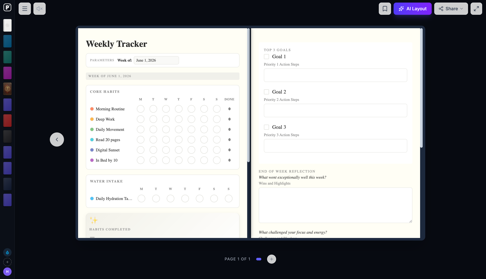

# papera — MCP server + CLI for [Papera](https://papera.io)

**Give your AI assistant the power to build real, structured, editable notebooks — planners, trackers, study pages — instead of walls of text.**

When Claude, Cursor, or Codex would normally answer *"here's your meal plan…"* in throwaway chat text, the Papera MCP server lets it create a **real Papera page** you keep, edit, print, and come back to.

```text
You:    "Plan a 4-week marathon build and put it in Papera."
Agent:  → papera_create_page("4-week marathon training plan with weekly
          mileage and a long-run tracker")
        → "Done — your plan is here: https://papera.io/app/notebook/…"
```

One package, two doors: an **MCP server** (`papera mcp`) for AI assistants, and a **CLI** (`papera new "…"`) for your terminal.

## See it

**A real multi-page plan, generated by an AI agent over MCP.** This "30-Day Growth Sprint" — positioning, an ideal-customer-profile table, and a partner-outreach pipeline — was produced by **Codex calling Papera's MCP tools**. Not a wall of text; a structured, editable notebook you keep:



**Your library** — every generation is a real, kept notebook:


---

## Quickstart — MCP in 2 minutes

### Step 1 — Sign in once

You need a free [Papera](https://papera.io) account (sign up takes ~20 seconds).

```bash
npx papera login
```

Email + password → a long-lived API key is saved to `~/.papera/config.json`. Your password is never stored — only a revocable key (`papera_live_…`).

> **Signed up with Google?** Set a password first: in the Papera app open **Settings → Account & security → Change password** (leave "current password" blank to set one for the first time). Then `npx papera login` works.

### Step 2 — Add the MCP server to your host

On the machine where you logged in, **no env vars are needed** — the server reads your saved key automatically.

**Claude Desktop / Cursor** (`mcpServers`):

```json
{
  "mcpServers": {
    "papera": {
      "command": "npx",
      "args": ["-y", "papera", "mcp"]
    }
  }
}
```

**Codex** (`~/.codex/config.toml`):

```toml
[mcp_servers.papera]
command = "npx"
args = ["-y", "papera", "mcp"]
```

**Claude Code (one-liner):**

```bash
claude mcp add papera -- npx -y papera mcp
```

### Step 3 — Use it

Ask your assistant things like:

- *"Build me an ADHD-friendly morning routine tracker in Papera."*
- *"Turn this project outline into a Papera notebook."*
- *"Check my habit tracker and fill in what I did this week."*

The assistant gets back a link to a real, editable page.

> **Different machine or CI?** Run `papera key` where you're logged in, then put it in the MCP config's env:
> ```json
> "env": { "PAPERA_API_KEY": "papera_live_…" }
> ```

### MCP tools

| Tool | What it does |
|---|---|
| `papera_create_page` | Turn a prompt into a real, editable Papera page. Returns an open URL. |
| `papera_list_notebooks` | List the user's notebooks (titles, ids, URLs). |
| `papera_get_notebook` | Inspect one notebook's pages. |
| `papera_get_tracker` | Read a notebook's habit tracker (rows, columns, cell states). |
| `papera_update_tracker` | Write cells into a tracker — fill a living tracker from any source the host has. |

**Costs:** generating a page spends **Ink** (Papera's AI credit) from your account. The free plan includes a monthly Ink allowance; if you run out the tools return a clear "Out of Ink" message with a top-up link. Listing/reading/updating trackers is free.

---

## CLI

The same power from your terminal:

```bash
# A page from a prompt
papera new "ADHD-friendly morning routine tracker"
papera new "sprint retro board" --pages 3 --open

# A multi-step plan from a goal
papera plan "launch my newsletter in 30 days"

# Your documents → a structured, multi-page notebook (reads files in full)
papera doc ./notes.md ./spec.html ./research.txt

# Browse
papera list                 # your notebooks
papera open <id>            # open in the browser

# Account
papera login                # sign in (stores a revocable API key)
papera key                  # print your API key (for MCP configs elsewhere)
papera keys                 # list + revoke API keys (asks your password)
papera whoami | logout
```

Every generation shows the **Ink cost** and asks before spending.

### Interactive console

```bash
papera                      # guided menu: explains itself, walks every flow
papera chat                 # agent that reads your current folder and builds pages
```

### Living trackers (optional)

`papera` can also act as an **MCP client**: connect your *own* MCP servers (calendar, GitHub, anything) in `~/.papera/mcp.json` (same format as Claude Desktop) and let `papera chat` pull from them to keep a tracker current. Auth lives in those servers — Papera stores no provider keys.

```bash
papera connections          # list your connected MCP servers + their tools
papera sync "Habit Tracker" --from github   # auto-fill a dev row from GitHub activity
```

> **Real example:** the multi-page **30-Day Growth Sprint** shown at the top of this README was generated by **Codex calling these MCP tools** — a single prompt to the agent, a structured 5-page notebook out.

---

## Configuration

Resolution order for every value: **environment variable → `~/.papera/config.json` → built-in default**.

| Variable | Purpose | Default |
|---|---|---|
| `PAPERA_API_KEY` | API key for auth (only needed off-machine / CI) | stored config from `papera login` |
| `PAPERA_API_URL` | Backend HTTP base | Papera production |
| `PAPERA_APP_URL` | Web app origin for open URLs | `https://papera.io` |
| `OPENAI_API_KEY` | optional — `papera plan` uses your GPT instead of Papera's brain | — |
| `GEMINI_API_KEY` | optional — offline fallback brain for `papera chat` | — |

## Troubleshooting

| Symptom | Fix |
|---|---|
| Tools say "Not authenticated" | Run `npx papera login` on this machine, or set `PAPERA_API_KEY` in the MCP config env. |
| `papera login` fails and you use Google sign-in | Set a password first: Papera app → Settings → Account & security. |
| "Out of Ink" | Top up or upgrade at [papera.io/app](https://papera.io/app). |
| Worried a key leaked? | `papera keys` — lists your keys and revokes the leaked one (asks your password; a key can't revoke keys). |

## Library (experimental)

The same client is importable: `import { PaperaClient } from "papera"`. Treat the HTTP API as `0.x`/experimental for now.

## License

[Apache-2.0](./LICENSE) © Papera
